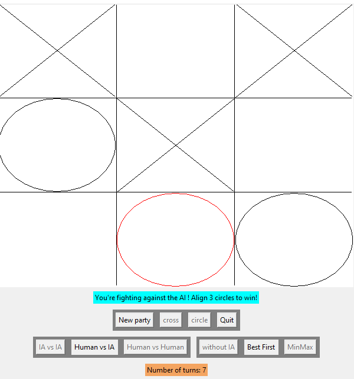

# tic-tac-toe-AI

Tic tac toe game using Python. You can fight against another player or an AI. You can also make two AIs fight against each others. Three algorgithms are avaiable when fighting against an AI: the dumb code (plays tiles randomly), the best first algorithm and the MinMax algorithm (almost unbeatable)

To make the game more interesting, only three tiles can be placed at the same time. This means that one can choose move one of his tiles in another case when he has already placed three tiles on the board.

When the number of turns attain 20, a winner is choosen by computing the score of each players. The score depends on the case where the tiles are placed. For example, the center case is more valuable and thus gives more points to the player who has a tile on it.

# How to run the code ?

You only need to have python 3.8 or above and run the code.py file to play the game.
